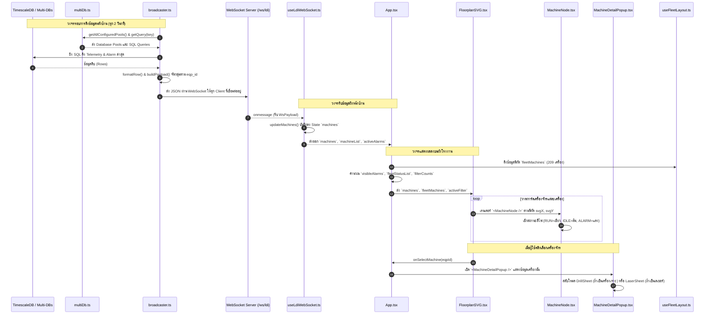

# เอกสารวิเคราะห์สถาปัตยกรรมและสารานุกรมฟังก์ชันระบบ IMS Floorplan-Web
> **ฉบับสมบูรณ์ ละเอียดระดับรายฟังก์ชันและผังการเชื่อมโยงข้ามไฟล์ (Comprehensive Architectural & Function Reference)**  
> *เอกสารนี้จัดทำขึ้นเพื่ออธิบายหน้าที่ของทุกไฟล์ ทุกฟังก์ชัน ทุกคอมโพเนนต์ ใครเป็นคนเรียกใช้ เรียกใช้ทำไม และส่งผลลัพธ์อะไรในระบบอย่างละเอียด 100%*

---

## สารบัญภาพรวม (Table of Contents)

1. [แผนภาพความสัมพันธ์และการไหลของข้อมูลทั้งระบบ (End-to-End System Call Flow)](#1-แผนภาพความสัมพันธ์และการไหลของข้อมูลทั้งระบบ)
2. [ระบบหลังบ้าน (Backend: Node.js & TypeScript)](#2-ระบบหลังบ้าน-backend-nodejs--typescript)
   - 2.1 [`backend/src/server.ts`](#21-backendsrcserverts)
   - 2.2 [`backend/src/broadcaster.ts`](#22-backendsrcbroadcasterts)
   - 2.3 [`backend/src/multiDb.ts`](#23-backendsrcmultidbts)
   - 2.4 [`backend/src/db.ts`](#24-backendsrcdbts)
   - 2.5 [`backend/src/config.ts`](#25-backendsrcconfigts)
   - 2.6 [`backend/src/types.ts`](#26-backendsrctypests)
   - 2.7 [`backend/src/routes/health.ts`](#27-backendsrcrouteshealthts)
   - 2.8 [`backend/src/routes/layout.ts`](#28-backendsrcrouteslayoutts)
   - 2.9 [`backend/src/routes/telemetry.ts`](#29-backendsrcroutestelemetryts)
   - 2.10 [`backend/data/databases.json`](#210-backenddatadatabasesjson-และ-databasesjsonexample)
   - 2.11 [`backend/data/custom_fleet.json`](#211-backenddatacustom_fleetjson)
   - 2.12 [`backend/data/queries/drill_db.sql`](#212-backenddataqueriesdrill_dbsql)
3. [ระบบหน้าบ้าน (Frontend: React, Vite & TypeScript)](#3-ระบบหน้าบ้าน-frontend-react-vite--typescript)
   - 3.1 [`frontend/src/main.tsx`](#31-frontendsrcmaintsex)
   - 3.2 [`frontend/src/App.tsx`](#32-frontendsrcapptsx)
   - 3.3 [`frontend/src/hooks/useLdiWebSocket.ts`](#33-frontendsrchooksuseldiwebsocketts)
   - 3.4 [`frontend/src/hooks/useFleetLayout.ts`](#34-frontendsrchooksusefleetlayoutts)
   - 3.5 [`frontend/src/components/TopBar.tsx`](#35-frontendsrccomponentstopbartsx)
   - 3.6 [`frontend/src/components/ProcessFilterBar.tsx`](#36-frontendsrccomponentsprocessfilterbartsx)
   - 3.7 [`frontend/src/components/FloorplanSVG.tsx`](#37-frontendsrccomponentsfloorplansvgtsx)
   - 3.8 [`frontend/src/components/FloorplanLegend.tsx`](#38-frontendsrccomponentsfloorplanlegendtsx)
   - 3.9 [`frontend/src/components/MachineNode.tsx`](#39-frontendsrccomponentsmachinenodetsx)
   - 3.10 [`frontend/src/components/MachineDetailPopup.tsx`](#310-frontendsrccomponentsmachinedetailpopuptsx)
   - 3.11 [`frontend/src/components/detail/DrillSheet.tsx`](#311-frontendsrccomponentsdetaildrillsheettsx)
   - 3.12 [`frontend/src/components/detail/LaserSheet.tsx`](#312-frontendsrccomponentsdetaillasersheettsx)
   - 3.13 [`frontend/src/components/detail/DatabaseMappingPanel.tsx`](#313-frontendsrccomponentsdetaildatabasemappingpaneltsx)
   - 3.14 [`frontend/src/components/AlarmPanel.tsx`](#314-frontendsrccomponentsalarmpaneltsx)
   - 3.15 [`frontend/src/components/StatusBar.tsx`](#315-frontendsrccomponentsstatusbartsx)
   - 3.16 [`frontend/src/components/DevLayoutToolbar.tsx`](#316-frontendsrccomponentsdevlayouttoolbartsx)
   - 3.17 [`frontend/src/constants/colors.ts`](#317-frontendsrcconstantscolorsts)
   - 3.18 [`frontend/src/constants/fleet.ts`](#318-frontendsrcconstantsfleetts)
   - 3.19 [`frontend/src/types/fleet.ts`](#319-frontendsrctypesfleetts)
   - 3.20 [`frontend/src/types/ldi.ts`](#320-frontendsrctypesldits)
   - 3.21 [`frontend/public/floorplan.svg`](#321-frontendpublicfloorplansvg)
   - 3.22 [`frontend/index.html` & CSS Configs](#322-frontendindexhtml-และไฟล์คอนฟิกสไตล์)
4. [ชุดทดสอบอัตโนมัติ (Automated Test Suites)](#4-ชุดทดสอบอัตโนมัติ-automated-test-suites)
   - 4.1 ชุดทดสอบหน้าบ้าน (Frontend Vitest)
   - 4.2 ชุดทดสอบหลังบ้าน (Backend Security & Integration Tests)
5. [โครงสร้างพื้นฐานและคอนเทนเนอร์ (Infrastructure & Containerization)](#5-โครงสร้างพื้นฐานและคอนเทนเนอร์)
   - 5.1 [`Dockerfile`](#51-dockerfile)
   - 5.2 [`nginx.conf`](#52-nginxconf)
   - 5.3 [`supervisord.conf`](#53-supervisordconf)
6. [ไฟล์ต้นแบบในอดีต (Legacy Prototype Archive)](#6-ไฟล์ต้นแบบในอดีต-legacy-prototype-archive)

---

## 1. แผนภาพความสัมพันธ์และการไหลของข้อมูลทั้งระบบ



---

## 2. ระบบหลังบ้าน (Backend: Node.js & TypeScript)

---

### 2.1 `backend/src/server.ts`
*หัวใจหลักของเซิร์ฟเวอร์หลังบ้าน (Application Entry Point)*

#### หน้าที่ของไฟล์
ทำหน้าที่เป็นจุดเริ่มต้นของกระบวนการทั้งหมด (Main Process) รวบรวมระบบ Express (REST API), ระบบเชื่อมต่อฐานข้อมูลหลัก, ระบบกระจายสัญญาณถ่ายทอดสด WebSocket เข้าด้วยกัน และเปิดพอร์ตฟังคำสั่งที่ Port 8000

#### รายการฟังก์ชันและการเชื่อมโยง

1. **`bootstrap(): Promise<void>`**
   - **หน้าที่:** สตาร์ตการทำงานของเซิร์ฟเวอร์ตามลำดับความปลอดภัย
   - **รับค่า:** ไม่มี
   - **ส่งค่ากลับ:** ไม่มี (เป็น Promise)
   - **ใครเรียกใช้:** ถูกเรียกโดยตรงที่บรรทัดสุดท้ายของ `server.ts` เมื่อรันคำสั่ง `node dist/server.js`
   - **ทำไมถึงเรียก:** เพื่อเตรียมความพร้อมของระบบ: (1) เชื่อมต่อฐานข้อมูลหลักผ่าน `db.connectWithRetry()`, (2) สั่งให้ `broadcaster.start()` เริ่มดึงข้อมูล, (3) สั่งให้ HTTP Server เปิดรับคำสั่งที่ Port 8000
   - **ผลลัพธ์:** เซิร์ฟเวอร์ออนไลน์พร้อมให้บริการทั้ง API และ WebSocket

2. **`shutdown(): Promise<void>`**
   - **หน้าที่:** ปิดระบบอย่างนุ่มนวล (Graceful Shutdown) เมื่อได้รับคำสั่งปิด
   - **รับค่า:** ไม่มี
   - **ส่งค่ากลับ:** ไม่มี
   - **ใครเรียกใช้:** สัญญาณของระบบปฏิบัติการ `process.on('SIGTERM')` และ `process.on('SIGINT')` (เช่น เมื่อกด Ctrl+C หรือ Docker สั่งหยุดคอนเทนเนอร์)
   - **ทำไมถึงเรียก:** ป้องกันฐานข้อมูลค้างและป้องกันการสูญหายของข้อมูล โดยจะสั่งหยุดตัวกระจายสัญญาณ `broadcaster.stop()`, ปิดการเชื่อมต่อ WebSocket `wss.close()`, ปิดเซิร์ฟเวอร์ HTTP และคืน Connection Pool ให้ฐานข้อมูล `db.disconnect()` ก่อนจบโปรเซส
   - **ผลลัพธ์:** คืนแรมและปิดการเชื่อมต่อทั้งหมดอย่างสะอาด 100%

3. **`app.get('/')`**
   - **หน้าที่:** Endpoint ตรวจสอบสถานะเบื้องต้น (Index Ping)
   - **ใครเรียกใช้:** เบราว์เซอร์ หรือระบบ Health Check ภายนอก
   - **ผลลัพธ์:** คืนค่า JSON สรุปข้อมูลของระบบ เช่น ชนิด Runtime, รายชื่อ Endpoints ทั้งหมด (`/api/health`, `/api/machines`, `/ws/ldi`)

4. **`wss.on('connection', (ws, req))`**
   - **หน้าที่:** จัดการเมื่อมีลูกข่าย (Client จากหน้าเว็บ) เปิดสาย WebSocket เข้ามาที่ `/ws/ldi`
   - **ใครเรียกใช้:** โมดูล `ws` เมื่อเกิด Handshake สำเร็จ
   - **ทำไมถึงเรียก:** เพื่อส่งตัวเชื่อมต่อ `ws` ไปลงทะเบียนไว้ใน `broadcaster.addClient(ws)`
   - **ผลลัพธ์:** หน้าเว็บจะได้รับภาพรวมข้อมูลล่าสุด (Initial Snapshot) ทันทีที่เชื่อมต่อติด

---

### 2.2 `backend/src/broadcaster.ts`
*สถานีศูนย์กลางถ่ายทอดสดข้อมูลเครื่องจักร (Telemetry Broadcaster Engine)*

#### หน้าที่ของไฟล์
เป็นเครื่องยนต์ที่ทำงานเบื้องหลังแบบวนรอบ (Background Polling Loop) ทุกๆ 2 วินาที คอยวิ่งไปยิง SQL ดึงข้อมูลจากฐานข้อมูลทุกตัวที่ลงทะเบียนไว้ แล้วแปลงข้อมูลเป็นรูปแบบมาตรฐานเพื่อยิงกระจาย (Broadcast) ให้กับหน้าเว็บทุกคนพร้อมกัน

#### รายการฟังก์ชันและการเชื่อมโยง

1. **`start(): void`**
   - **หน้าที่:** เริ่มต้นลูปการดึงข้อมูลอัตโนมัติ
   - **ใครเรียกใช้:** `bootstrap()` ใน `server.ts`
   - **ทำไมถึงเรียก:** เพื่อให้ระบบเริ่มดึงข้อมูลทันทีที่เซิร์ฟเวอร์เปิดขึ้นมา
   - **ผลลัพธ์:** มีการตั้งเวลา `setInterval` ทำงานฟังก์ชัน `pollAndBroadcast()` ทุกๆ 2,000 มิลลิวินาที (ตั้งค่าได้จาก `config.BROADCAST_INTERVAL_MS`)

2. **`stop(): void`**
   - **หน้าที่:** หยุดลูปการดึงข้อมูล
   - **ใครเรียกใช้:** `shutdown()` ใน `server.ts`
   - **ทำไมถึงเรียก:** ล้างค่า Timer ทิ้งเพื่อไม่ให้เกิด Memory Leak เวลาปิดระบบ

3. **`addClient(ws: WebSocket): void`**
   - **หน้าที่:** ลงทะเบียน Client รายใหม่เข้าสู่รายการผู้รับสัญญาณ
   - **รับค่า:** `ws` (อินสแตนซ์การเชื่อมต่อ WebSocket ของผู้ใช้)
   - **ใครเรียกใช้:** `server.ts` เมื่อมีคนเปิดหน้าเว็บเข้ามา
   - **ทำไมถึงเรียก:** เก็บตัวแปรไว้ใน `Set<WebSocket>` เพื่อส่งข้อมูลให้ในรอบถัดไป และหากเซิร์ฟเวอร์มีข้อมูลเก่าในมือ (`lastSnapshot`) จะส่ง Snapshot ให้ผู้ใช้รายนั้นทันที ไม่ต้องรอให้จบรอบ 2 วินาที
   - **ผลลัพธ์:** ผู้ใช้ใหม่เห็นข้อมูลบนผังโรงงานทันทีภายในเสี้ยววินาทีแรก

4. **`fetchTelemetry(): Promise<LdiMachine[]>`**
   - **หน้าที่:** วิ่งไปรวบรวมข้อมูลเซนเซอร์จากทุกฐานข้อมูลในโรงงาน
   - **ใครเรียกใช้:** (1) ลูปภายใน `pollAndBroadcast()`, (2) Route `/api/snapshot` ใน `telemetry.ts`
   - **ทำไมถึงเรียก:** ดึงข้อมูลดิบจาก TimescaleDB ผ่านคำสั่ง `PRIMARY_TELEMETRY_SQL` และวนลูปดึงข้อมูลจากฐานข้อมูลเสริมตัวอื่นๆ (เช่น `drill_db`, `chem_db`) ผ่าน `multiDb.getAllConfiguredPools()`
   - **ผลลัพธ์:** ได้อาร์เรย์ของวัตถุ `LdiMachine[]` รวมของทุกเครื่องจักรในโรงงาน

5. **`formatRow(row: any, dbKey = 'timescale', defaultProcessType?: string): LdiMachine`**
   - **หน้าที่:** กรองและแปลงชนิดข้อมูลดิบจาก SQL (Row Parser) ให้ตรงตามสเปก TypeScript
   - **ใครเรียกใช้:** ฟังก์ชัน `fetchTelemetry()`
   - **ทำไมถึงเรียก:** ฐานข้อมูลแต่ละตัวส่งชื่อคอลัมน์มาไม่เหมือนกัน เช่น เครื่องเจาะส่ง `event_type`, เครื่องเลเซอร์ส่ง `temperature`, `scan_speed` ฟังก์ชันนี้จะแปลงค่า null, แปลงตัวเลขทศนิยม, แปลงวันที่เป็น ISO String และแปะป้าย `process_type` และ `db_key` ให้ถูกต้อง
   - **ผลลัพธ์:** วัตถุข้อมูลเครื่องจักรที่สะอาด ปลอดภัย ไร้ค่าเพี้ยน

6. **`buildPayload(machines: LdiMachine[]): WsPayload`**
   - **หน้าที่:** สร้างแพ็กเกจข้อมูลสำหรับส่งผ่านสายเคเบิล WebSocket
   - **รับค่า:** อาร์เรย์ของเครื่องจักร `machines`
   - **ใครเรียกใช้:** `pollAndBroadcast()` และ `addClient()`
   - **ทำไมถึงเรียก:** จัดโครงสร้างข้อมูลให้หน้าเว็บค้นหาได้เร็วที่สุดระดับ O(1) โดยสร้างพจนานุกรม `machines: Record<string, LdiMachine>` ที่แมปตาม `eqp_id` พร้อมทั้งสร้างรายการเครื่องที่ติดสัญญาณเตือนภัย `active_alarms: string[]`
   - **ผลลัพธ์:** วัตถุ `WsPayload` ที่พร้อมส่งออกไปเป็น JSON

7. **`pollAndBroadcast(): Promise<void>`**
   - **หน้าที่:** ทำการดึงข้อมูลและกระจายออกไปหาเบราว์เซอร์ทุกคน
   - **ใครเรียกใช้:** ถูกสั่งทำงานอัตโนมัติตามรอบเวลาใน `setInterval` ของ `start()`
   - **ทำไมถึงเรียก:** มีระบบป้องกันชนกัน (`isPolling`) ถ้าคำสั่งเก่ายังตอบกลับไม่เสร็จ จะไม่ยิงซ้ำซ้อน เมื่อได้ข้อมูลจะแปลงเป็น JSON String รอบเดียว แล้ววนลูปส่งผ่าน `client.send(jsonStr)` ให้เบราว์เซอร์ทุกตัวที่สถานะเป็น `WebSocket.OPEN`
   - **ผลลัพธ์:** หน้าจอผังโรงงานของทุกคนในระบบ อัปเดตสีไฟและตัวเลขพร้อมกันแบบ Real-time

---

### 2.3 `backend/src/multiDb.ts`
*ผู้จัดการระบบเชื่อมต่อหลายฐานข้อมูล (Multi-Database Connection Manager)*

#### หน้าที่ของไฟล์
เป็นกลไกที่ทำให้ระบบสามารถเชื่อมต่อกับฐานข้อมูลโรงงานได้หลายตัวพร้อมกัน (Multi-DB Architecture) โดยอ่านการตั้งค่าจากไฟล์ `databases.json` มีระบบ Connection Pool, การสลับ Host อัตโนมัติใน Docker และการดึงรหัสผ่านจาก Environment Variable

#### รายการฟังก์ชันและการเชื่อมโยง

1. **`constructor()`**
   - **หน้าที่:** เริ่มต้นระบบ Multi-DB อัตโนมัติเมื่อเริ่มโปรแกรม
   - **การทำงาน:** ลงทะเบียนฐานข้อมูลหลัก `timescale` จากตัวแปรระบบ (`config.PGHOST`) แล้วเรียกคำสั่ง `loadFromConfigFile()` เพื่อโหลดฐานข้อมูลภายนอกอื่นๆ

2. **`resolveHost(host: string): string`**
   - **หน้าที่:** ตรวจสอบสภาพแวดล้อมเพื่อแปลงชื่อโฮสต์
   - **ใครเรียกใช้:** `registerPool()`
   - **ทำไมถึงเรียก:** หากโปรแกรมรันอยู่ภายใน Docker Container แล้วผู้ใช้กรอก Host เป็น `localhost` หรือ `127.0.0.1` ในไฟล์คอนฟิก Docker จะมองไม่เห็นเครื่องจริง ฟังก์ชันนี้จะแปลงเป็น `host.docker.internal` ให้เองโดยอัตโนมัติ
   - **ผลลัพธ์:** สามารถเชื่อมต่อฐานข้อมูลภายนอกได้ทั้งบน Windows Host และใน Container โดยที่ผู้ใช้ไม่ต้องแก้คอนฟิกไปมา

3. **`registerPool(spec: DbConnectionSpec): void`**
   - **หน้าที่:** สร้างและลงทะเบียนท่อเชื่อมต่อ (Connection Pool) สำหรับฐานข้อมูล 1 ตัว
   - **รับค่า:** วัตถุ `spec` (ชื่อ key, host, port, database, user, password_env, query ฯลฯ)
   - **ใครเรียกใช้:** (1) `constructor` (สำหรับ timescale), (2) `loadFromConfigFile()` (สำหรับฐานข้อมูลเสริมใน JSON)
   - **ทำไมถึงเรียก:** ใช้คลาส `new Pool()` ของ PostgreSQL โดยตั้งค่า `idleTimeoutMillis: 30000` (ตัดท่อว่างเพื่อประหยัดแรม) และ `keepAlive: true` ป้องกันสายหลุด พร้อมทั้งตรวจจับรหัสผ่านว่าผูกกับชื่อตัวแปรใน `.env` (`spec.password_env`) หรือไม่ เพื่อความปลอดภัยขั้นสูงสุด
   - **ผลลัพธ์:** ได้ Pool ที่พร้อมใช้งาน บันทึกเก็บไว้ในตัวแปร `this.pools`

4. **`loadFromConfigFile(): void`**
   - **หน้าที่:** อ่านและวิเคราะห์ไฟล์ `data/databases.json`
   - **ใครเรียกใช้:** `constructor()`
   - **ทำไมถึงเรียก:** เพื่อให้ผู้ดูแลระบบสามารถเพิ่มฐานข้อมูลใหม่ได้ง่ายๆ เพียงพิมพ์ใส่ไฟล์ JSON แล้วฟังก์ชันนี้จะวนลูปเรียก `registerPool()` ให้ครบทุกตัว
   - **ผลลัพธ์:** ฐานข้อมูลใหม่ถูกเชื่อมต่อเข้าสู่ระบบทันทีโดยไม่ต้องแก้โค้ดโปรแกรมแม้แต่บรรทัดเดียว

5. **`getQuery(key: string): string | null`**
   - **หน้าที่:** ดึงคำสั่ง SQL สำหรับดึงข้อมูลของฐานข้อมูลตัวนั้น
   - **รับค่า:** `key` (เช่น `"drill_db"`)
   - **ใครเรียกใช้:** `broadcaster.fetchTelemetry()`
   - **ทำไมถึงเรียก:** คำนวณลำดับความสำคัญ: ถ้าใน JSON มีคีย์ `query` จะดึงข้อความ SQL นั้นมาใช้ทันที แต่ถ้ามีคีย์ `query_file` จะไปอ่านเนื้อหาจากไฟล์ `.sql` บนดิสก์ พร้อมทั้งแคชข้อความไว้ในหน่วยความจำ (`this.queryCache`) เพื่อไม่ต้องเปิดอ่านไฟล์ซ้ำๆ ทุก 2 วินาที
   - **ผลลัพธ์:** ได้สตริงคำสั่ง SQL ที่พร้อมนำไป Execute กับ Database

6. **`getAllConfiguredPools(): Array<{ key: string; pool: pg.Pool; spec: DbConnectionSpec }>`**
   - **หน้าที่:** ส่งคืนรายการ Connection Pool ทั้งหมดที่ลงทะเบียนไว้พร้อมสเปกของมัน
   - **ใครเรียกใช้:** `broadcaster.fetchTelemetry()`
   - **ผลลัพธ์:** ตัวบรอดแคสต์รู้ว่าจะต้องวนลูปไปดึงข้อมูลจากที่ไหนบ้าง

7. **`resolveTarget(machine: { id: string; name?: string; process?: string; telemetryId?: string }): RouteTarget`**
   - **หน้าที่:** วิเคราะห์เครื่องจักรว่าข้อมูลควรจะวิ่งไปลงที่ฐานข้อมูลตัวใด (Smart Routing)
   - **รับค่า:** ข้อมูลเครื่องจักร
   - **ใครเรียกใช้:** ระบบแมปปิ้งหรือการตรวจสอบความถูกต้อง
   - **ทำไมถึงเรียก:** รองรับไวยากรณ์ขั้นสูง เช่น ถ้าผู้ใช้ผูกไอดีว่า `drill_db:DRL054-M` ฟังก์ชันจะตัดแบ่งได้ทันทีว่า Database คือ `drill_db` และไอดีจริงคือ `DRL054-M`

---

### 2.4 `backend/src/db.ts`
*ตัวจัดการฐานข้อมูลหลัก TimescaleDB (Primary Database Connection)*

#### หน้าที่ของไฟล์
ดูแลท่อส่งข้อมูลหลักของระบบ (Primary Hypertable สำหรับเก็บข้อมูลเซนเซอร์ LDI และระบบแจ้งเตือน Alarm)

#### รายการฟังก์ชันและการเชื่อมโยง

1. **`initPool(): void`**
   - **หน้าที่:** สร้าง Connection Pool สำหรับต่อกับ PostgreSQL/TimescaleDB
   - **ใครเรียกใช้:** `constructor` ของคลาส `Database`

2. **`connectWithRetry(maxRetries = 5, initialBackoffMs = 1000): Promise<boolean>`**
   - **หน้าที่:** พยายามเชื่อมต่อฐานข้อมูลหลัก พร้อมระบบถอยเวลารออัตโนมัติ (Exponential Backoff)
   - **ใครเรียกใช้:** `bootstrap()` ใน `server.ts`
   - **ทำไมถึงเรียก:** ในระบบโรงงานหรือ Docker สภาพแวดล้อมฐานข้อมูลอาจใช้เวลาสตาร์ตนานกว่าเว็บแอป ฟังก์ชันนี้จะทดลองรันคำสั่ง `SELECT 1 as alive` หากไม่ผ่านจะรอ 1s, 2s, 4s, 8s สูงสุด 5 ครั้ง จนกว่าฐานข้อมูลจะพร้อม
   - **ผลลัพธ์:** ป้องกันไม่ให้เว็บแอปพลิเคชัน Crash หรือดับระหว่างบูตเครื่อง

3. **`checkHealth(): Promise<boolean>`**
   - **หน้าที่:** ทดสอบว่าฐานข้อมูลยังตอบสนองอยู่หรือไม่
   - **ใครเรียกใช้:** Route `/api/health` ใน `health.ts`
   - **ผลลัพธ์:** คืนค่า `true` ถ้าฐานข้อมูลตอบสนองปกติ, คืนค่า `false` ถ้าสายหลุด

4. **`getPoolStats(): { free: number; used: number; total: number }`**
   - **หน้าที่:** ตรวจสอบสถิติจำนวนท่อเชื่อมต่อของฐานข้อมูล
   - **ใครเรียกใช้:** Route `/api/health` ใน `health.ts`
   - **ผลลัพธ์:** ทราบว่ามี Connection ว่างอยู่กี่ท่อ และกำลังใช้งานอยู่กี่ท่อ เพื่อใช้วิเคราะห์ประสิทธิภาพ

5. **`query<T>(text: string, params?: any[]): Promise<pg.QueryResult<T>>`**
   - **หน้าที่:** ฟังก์ชันกลางสำหรับรันคำสั่ง SQL กับฐานข้อมูลหลักแบบ Parameterized ปลอดภัยจาก SQL Injection
   - **ใครเรียกใช้:** `broadcaster.ts` และ `telemetry.ts`

---

### 2.5 `backend/src/config.ts`
*ศูนย์รวมค่าคอนฟิกและตัวแปรสภาพแวดล้อม (Environment Configuration)*

#### หน้าที่ของไฟล์
อ่านค่าตัวแปรระบบ (`process.env`) และตั้งค่ามาตรฐาน (Fallback Defaults) สำหรับการทำงานของหลังบ้าน:
- `PORT`: พอร์ตของเซิร์ฟเวอร์ (ค่าเริ่มต้น `8000`)
- `PGHOST`, `PGPORT`, `PGDATABASE`, `PGUSER`, `PGPASSWORD`: ข้อมูลเข้าถึงฐานข้อมูลหลัก
- `BROADCAST_INTERVAL_MS`: ความถี่ในการดึงข้อมูลสด (ค่าเริ่มต้น `2000` ms = 2 วินาที)
- `STALENESS_THRESHOLD_MINUTES`: ระยะเวลานาทีที่จะตัดสินว่าเครื่องจักรขาดการติดต่อและเปลี่ยนเป็นสถานะสีเทา OFF (ค่าเริ่มต้น `5` นาที)
- `ALARM_WINDOW_MINUTES`: หน้าต่างเวลาย้อนหลังสำหรับดึงประวัติแจ้งเตือนภัยที่ยังมีผลอยู่ (ค่าเริ่มต้น `15` นาที)
- `LAYOUT_FILE`: พิกัดไฟล์เก็บผังโรงงาน (`data/custom_fleet.json`)

---

### 2.6 `backend/src/types.ts`
*แม่แบบประเภทข้อมูลฝั่งหลังบ้าน (Backend TypeScript Interfaces)*

#### หน้าที่ของไฟล์
กำหนดโครงสร้างข้อมูลอย่างเข้มงวด ป้องกันข้อผิดพลาดในการเขียนโปรแกรม:
- `LdiMachine`: โครงสร้างข้อมูลเครื่องจักร 15 ตัวแปรหลัก (อุณหภูมิ, ความชื้น, สถานะ, ความเร็ว, ฯลฯ)
- `WsPayload`: โครงสร้างข้อความ WebSocket
- `LayoutData`: โครงสร้างของข้อมูลผังโรงงานที่บันทึกลงดิสก์
- `MachineCustomDef`: ข้อมูลพิกัดและขนาดของการ์ดที่ปรับแต่งได้

---

### 2.7 `backend/src/routes/health.ts`
*ช่องทางตรวจสอบความพร้อมของระบบ (Health Check Route)*

#### หน้าที่ของไฟล์
ให้บริการทางเข้า API เส้นทาง `GET /api/health`

#### รายการฟังก์ชันและการเชื่อมโยง
- **`healthRouter.get('/health')`**
  - **ใครเรียกใช้:** Docker Container Health Check, Nginx, หรือเครื่องมือมอนิเตอร์สถานะระบบ
  - **ทำไมถึงเรียก:** ตรวจสอบว่าระบบยังทำงานได้ดีอยู่หรือไม่
  - **การทำงาน:** เรียก `db.checkHealth()` เพื่อเช็กฐานข้อมูล, เรียก `broadcaster.getClientCount()` เพื่อดูจำนวนหน้าเว็บที่กำลังดูอยู่, และเรียก `db.getPoolStats()` เพื่อดูสถานะการเชื่อมต่อ
  - **ผลลัพธ์:** หากปกติจะส่งรหัส `HTTP 200 { status: 'healthy', db_connected: true }` หากฐานข้อมูลล่มจะส่ง `HTTP 503 { status: 'degraded', db_connected: false }`

---

### 2.8 `backend/src/routes/layout.ts`
*ช่องทางจัดการผังโรงงาน (Floorplan Layout Route)*

#### หน้าที่ของไฟล์
ให้บริการ API สำหรับการอ่าน บันทึก และล้างค่าพิกัดการวางตำแหน่งเครื่องจักร

#### รายการฟังก์ชันและการเชื่อมโยง

1. **`GET /api/layout`**
   - **ใครเรียกใช้:** Hook `useFleetLayout.ts` ในฝั่งหน้าบ้าน ตอนเปิดเว็บครั้งแรก
   - **การทำงาน:** เข้าไปอ่านไฟล์ `data/custom_fleet.json` หากมีไฟล์อยู่ จะส่งรายการเครื่องจักรที่มีการย้ายตำแหน่ง (`machines`) และรายการเครื่องจักรที่ถูกลบ (`deletedIds`) กลับไป
   - **ผลลัพธ์:** หน้าเว็บจะจัดตำแหน่งเครื่องจักรตามที่วิศวกรเคยเซฟไว้ล่าสุด

2. **`POST /api/layout`**
   - **ใครเรียกใช้:** (1) ปุ่ม "Save Layout to Server" ในแถบเครื่องมือวิศวกร `DevLayoutToolbar.tsx`, (2) ฟอร์มบันทึกการผูก Database `DatabaseMappingPanel.tsx` ในหน้าต่างเครื่องจักร
   - **การทำงาน:** มีระบบตรวจจับความปลอดภัย ตรวจสอบว่า `machines` และ `deletedIds` เป็นอาร์เรย์จริงหรือไม่ และจำกัดจำนวนไม่เกิน 5,000 รายการเพื่อป้องกัน Denial of Service (DoS) จากนั้นเขียนบันทึกลงไฟล์ `data/custom_fleet.json`
   - **ผลลัพธ์:** พิกัดและชื่อใหม่ถูกบันทึกถาวรลงในเซิร์ฟเวอร์

3. **`DELETE /api/layout`**
   - **ใครเรียกใช้:** ปุ่ม "Reset Layout" ใน `DevLayoutToolbar.tsx`
   - **การทำงาน:** สั่งลบไฟล์ `data/custom_fleet.json` บนดิสก์
   - **ผลลัพธ์:** ผังโรงงานจะกลับไปใช้ค่าพิกัดเริ่มต้นจากไฟล์แปลน CAD แม่บท (`fleet.ts`)

---

### 2.9 `backend/src/routes/telemetry.ts`
*ช่องทางส่งข้อมูลเซนเซอร์และประวัติย้อนหลัง (Telemetry & History Route)*

#### หน้าที่ของไฟล์
ให้บริการ API ข้อมูลเครื่องจักรแบบ REST

#### รายการฟังก์ชันและการเชื่อมโยง

1. **`GET /api/machines`**
   - **หน้าที่:** ดึงรายชื่อเครื่องจักรทั้งหมดพร้อมสถานะล่าสุดจาก TimescaleDB

2. **`GET /api/snapshot`**
   - **หน้าที่:** ดึงภาพรวมข้อมูลเซนเซอร์ทั้งหมดของโรงงานแบบทันที (Instant Snapshot)
   - **ใครเรียกใช้:** `useLdiWebSocket.ts` ตอนเปิดเว็บเข้ามาครั้งแรก หรือเป็น Fallback เมื่อสัญญาณ WebSocket ขัดข้อง
   - **การทำงาน:** สั่ง `broadcaster.fetchTelemetry()` ดึงข้อมูลสดจากทุกฐานข้อมูล แล้วแพ็กส่งกลับเป็น JSON

3. **`GET /api/history/:eqp_id`**
   - **หน้าที่:** ดึงข้อมูลประวัติย้อนหลังของเครื่องจักรรายตัว (เช่น ย้อนหลัง 50 เรคคอร์ด)
   - **ใครเรียกใช้:** ป้ายกราฟประวัติ หรือฟังก์ชันวิเคราะห์ข้อมูลย้อนหลัง

---

### 2.10 `backend/data/databases.json` และ `databases.json.example`
*ไฟล์คอนฟิกศูนย์รวมฐานข้อมูล (Single-Point Dynamic DB Registration)*

#### หน้าที่ของไฟล์
เป็นที่อยู่เดียวในการเพิ่มฐานข้อมูลใหม่ของโรงงาน มีโครงสร้างเช่น:
```json
{
  "drill_db": {
    "host": "192.168.1.50",
    "port": 5432,
    "database": "drill_factory",
    "user": "viewer",
    "password_env": "DRILL_DB_PASSWORD",
    "process_type": "DRILLING",
    "query_file": "queries/drill_db.sql",
    "enabled": true
  }
}
```
- **ความสำคัญ:** วิศวกรเพียงแก้ไขไฟล์นี้ ระบบจะโหลดท่อเชื่อมต่อและคำสั่ง SQL ขึ้นมาอ่านอัตโนมัติ โดยไม่ต้องเขียนโค้ดเพิ่ม
- **ความปลอดภัย:** ไฟล์ `databases.json` จริงได้รับการป้องกันใน `.gitignore` ไม่ถูกส่งขึ้น GitHub ส่วนไฟล์ `databases.json.example` ใช้เป็นแม่แบบ

---

### 2.11 `backend/data/custom_fleet.json`
*ไฟล์เก็บบันทึกพิกัดผังโรงงานที่วิศวกรจัดไว้ (Persisted Layout Storage)*

#### หน้าที่ของไฟล์
เก็บบันทึกรายการเครื่องจักรที่มีการย้ายตำแหน่ง (X, Y), ขนาดการ์ด (Width, Height), การเปลี่ยนชื่อป้าย, และการผูก ID เซนเซอร์ (`telemetryId`)

---

### 2.12 `backend/data/queries/drill_db.sql`
*ไฟล์คำสั่ง SQL ดึงข้อมูลเครื่องเจาะ (External Drilling Query)*

#### หน้าที่ของไฟล์
เก็บคำสั่ง SQL เฉพาะทางสำหรับดึงข้อมูลเครื่องเจาะแผ่นวงจรจากฐานข้อมูล `tbl_dr_event` ช่วยแยกโค้ด SQL ยาวๆ ออกจากไฟล์ JSON คอนฟิกเพื่อให้อ่านง่าย

---

## 3. ระบบหน้าบ้าน (Frontend: React, Vite & TypeScript)

---

### 3.1 `frontend/src/main.tsx`
*จุดสตาร์ตของแอปพลิเคชันหน้าบ้าน (Frontend Root)*

#### หน้าที่ของไฟล์
เป็นไฟล์แรกสุดที่ถูกเรียกโดย `index.html` ทำหน้าที่นำคอมโพเนนต์หลัก `<App />` ไปประกอบเข้ากับ DOM Node ชื่อ `<div id="root"></div>` พร้อมกับโหลดไฟล์สไตล์ CSS หลัก `index.css`

---

### 3.2 `frontend/src/App.tsx`
*วาทยกรและศูนย์รวมการทำงานของหน้าจอ (Main Dashboard Orchestrator)*

#### หน้าที่ของไฟล์
เป็นคอมโพเนนต์หลักที่รวบรวมทุกองค์ประกอบบนหน้าจอ (TopBar, FilterBar, Floorplan, Inspector Drawer, Alarm Banner, StatusBar, DevToolbar) และจัดการ State ข้ามคอมโพเนนต์

#### รายการฟังก์ชันและการเชื่อมโยง

1. **`handleSaveMachineMapping(id: string, newName: string, newTelemetryId?: string): Promise<void>`**
   - **หน้าที่:** บันทึกการเปลี่ยนชื่อป้ายแสดงผล หรือการจับคู่ ID เครื่องจักรเข้ากับฐานข้อมูล (1:1 Binding)
   - **ใครเรียกใช้:** ส่งต่อไปให้ `<MachineDetailPopup />` และถูกเรียกเมื่อกดปุ่ม "APPLY & SAVE MAPPING" ใน `<DatabaseMappingPanel />`
   - **การทำงาน:** ปรับปรุงข้อมูลใน State `fleetMachines` จากนั้นยิง `POST /api/layout` เพื่อบันทึกพิกัดและชื่อใหม่ลงเซิร์ฟเวอร์
   - **ผลลัพธ์:** ป้ายบนผังโรงงานเปลี่ยนชื่อทันที และผูกเข้ากับสัญญาณสดของเซนเซอร์ตัวใหม่

2. **`filterCounts` (Memoized)**
   - **หน้าที่:** คำนวณจำนวนเครื่องจักรในแต่ละแผนกแบบเรียลไทม์
   - **ใครเรียกใช้:** ส่งให้ `<ProcessFilterBar counts={filterCounts} />`
   - **ผลลัพธ์:** ตัวเลขบนปุ่มกดแผนกแสดงจำนวนเครื่องที่แท้จริง เช่น DRILLING (144), LASER (10)

3. **`handleSelectFilter(filter: FleetFilterOption): void`**
   - **หน้าที่:** สลับโหมดการมองเห็นแผนกการผลิต
   - **ใครเรียกใช้:** ปุ่มกดบน `<TopBar />` หรือ `<ProcessFilterBar />`
   - **การทำงาน:** สั่งให้กล้องใน `<FloorplanSVG />` ขยับและซูมเข้าไปยังพิกัดพื้นที่ของแผนกนั้นตามค่าที่ตั้งไว้ใน `CAMERA_FOCUS_PRESETS`
   - **ผลลัพธ์:** แผนกที่เลือกจะสว่างชัดเจน ส่วนแผนกอื่นจะหรี่แสงลงเล็กน้อย (Dimmed) เพื่อโฟกัสสายตา

4. **`handleFocusMachine(svgX: number, svgY: number, eqpId?: string): void`**
   - **หน้าที่:** สั่งให้กล้องพุ่งเป้าไปหาเครื่องจักรที่ระบุแบบเจาะจง
   - **ใครเรียกใช้:** (1) ปุ่ม "Focus" ใน `<AlarmPanel />` เมื่อเกิดสัญญาณเตือนภัย, (2) ปุ่ม "Focus Camera" ใน `<MachineDetailPopup />`
   - **การทำงาน:** เรียกฟังก์ชัน `panzoomRef.current.zoomToMachine(svgX, svgY, 2.4)`
   - **ผลลัพธ์:** มุมมองกล้องจะวิ่งแบบแอนิเมชันนุ่มนวลไปอยู่ตรงกลางเครื่องนั้น พร้อมเปิดหน้าต่างตรวจสอบสเปกขึ้นมาทันที

5. **`visibleAlarms` (Memoized)**
   - **หน้าที่:** กรองรายการเตือนภัย (Alarm) ให้แสดงเฉพาะเครื่องที่มีอยู่จริงบนผังโรงงาน
   - **ทำไมถึงมี:** ป้องกันปัญหาเครื่องจักรที่ถูกรื้อถอนหรือลบออกจากผังแล้ว แต่ยังมี Log เตือนภัยเก่าค้างในฐานข้อมูล ไม่ให้โผล่ขึ้นมากวนใจสายตาผู้ควบคุม

6. **`fleetStatusList` (Memoized)**
   - **หน้าที่:** รวบรวมสถานะของเครื่องจักรทุกตัวบนผัง เพื่อส่งให้ `<TopBar />` นำไปนับยอดสรุป RUN / IDLE / ALARM / OFF

---

### 3.3 `frontend/src/hooks/useLdiWebSocket.ts`
*สายอากาศรับสัญญาณสดและการกู้คืนการเชื่อมต่อ (WebSocket Client Hook)*

#### หน้าที่ของไฟล์
จัดการการเชื่อมต่อ WebSocket กับหลังบ้าน (`/ws/ldi`) รับข้อมูลสถานะเครื่องจักร และมีระบบกู้คืนการเชื่อมต่ออัตโนมัติ (Resilience & Auto-Reconnect)

#### รายการฟังก์ชันและการเชื่อมโยง

1. **`createInitialMachineMap(): Record<string, LdiMachine>`**
   - **หน้าที่:** สร้างวัตถุข้อมูลจำลองเริ่มต้นสำหรับเครื่องจักรหลัก เพื่อไม่ให้หน้าเว็บว่างเปล่าขณะกำลังเริ่มต่อสาย

2. **`updateMachines(payload: any): void`**
   - **หน้าที่:** นำข้อมูลก้อนใหม่จาก WebSocket มาอัปเดตลงใน State `machines`
   - **ใครเรียกใช้:** Event `ws.onmessage` และฟังก์ชัน `refreshSnapshot()`
   - **การทำงาน:** ตรวจสอบรูปแบบข้อมูล และทำการทำชื่อจำลอง (Aliasing) สำหรับเครื่องเจาะ เช่น `DRL054-M` ให้ค้นหาผ่านเลขย่อ `054` หรือ `DRL-054` ได้
   - **ผลลัพธ์:** ข้อมูลสถานะในหน้าจอเปลี่ยนเป็นข้อมูลล่าสุดทันที

3. **`connectWs(): void`**
   - **หน้าที่:** สร้างและเปิดการเชื่อมต่อ WebSocket ไปยังเซิร์ฟเวอร์
   - **การทำงาน:** มีระบบ Exponential Backoff: หากสายหลุดหรือเซิร์ฟเวอร์รีสตาร์ต จะรอ 1s, 2s, 4s, 8s สูงสุด 30s แล้วลองต่อใหม่เรื่อยๆ จนกว่าจะติด โดยไม่ทำให้หน้าเว็บค้าง
   - **ผลลัพธ์:** ป้ายไฟสถานะบน TopBar จะแสดงสถานะ `● RECONNECTING...` และกลับมาเป็น `● LIVE` เองเมื่อต่อติด

4. **`refreshSnapshot(): Promise<void>`**
   - **หน้าที่:** ยิงคำสั่ง HTTP `GET /api/snapshot` เพื่อดึงข้อมูลมาแสดงผลทางลัด
   - **ใครเรียกใช้:** ทำงานทันทีตอนโหลดหน้าเว็บครั้งแรก และทำงานเป็นรอบสำรอง (Fallback) หาก WebSocket ไม่สามารถเชื่อมต่อได้

---

### 3.4 `frontend/src/hooks/useFleetLayout.ts`
*สมองกลคำนวณการจัดผังและแก้ไขพิกัด (Floorplan Layout Engine Hook)*

#### หน้าที่ของไฟล์
ควบคุมระบบจัดผังโรงงานทั้งหมด รองรับการลากย้ายการ์ด, การเลือกกลุ่มแบบคลุมกล่อง (Marquee Selection), การจัดแนว, การย่อขยาย, และการบันทึกข้อมูลทั้งใน LocalStorage และ Server

#### รายการฟังก์ชันสำคัญและการเชื่อมโยง

1. **`moveGroupPositions(initialPositions, deltaX, deltaY): void`**
   - **หน้าที่:** เลื่อนตำแหน่งเครื่องจักรหลายๆ เครื่องไปพร้อมกันตามระยะที่เมาส์ลาก
   - **ใครเรียกใช้:** `<FloorplanSVG />` ตอนที่วิศวกรคลิกลากการ์ดที่ถูกเลือกหลายใบพร้อมกัน

2. **`alignSelected(type, currentMachines): void`**
   - **หน้าที่:** จัดเรียงเครื่องจักรที่เลือกให้เป็นระเบียบ
   - **รับค่า:** `type` ได้แก่ `'left'` (ชิดซ้ายเท่ากัน), `'top'` (ชิดบนเท่ากัน), `'distribute-h'` (เกลี่ยระยะห่างแนวนอนเท่ากัน), `'distribute-v'` (เกลี่ยระยะห่างแนวตั้งเท่ากัน)
   - **ใครเรียกใช้:** ปุ่ม Align ในแถบเครื่องมือ `<DevLayoutToolbar />`

3. **`applySizeToProcess(process, width, height): void`**
   - **หน้าที่:** ปรับขนาดการ์ดเครื่องจักรทุกเครื่องในแผนกนั้นให้เท่ากันทั้งหมดในคลิกเดียว

4. **`saveLayoutToServer(): Promise<void>`**
   - **หน้าที่:** ส่งข้อมูลผังล่าสุดไปบันทึกถาวรที่ `POST /api/layout`

5. **`resetLayout(): Promise<void>`**
   - **หน้าที่:** ล้างค่าที่เคยบันทึกไว้ และเรียก `DELETE /api/layout` เพื่อย้อนกลับไปใช้ผัง CAD ดั้งเดิม

---

### 3.5 `frontend/src/components/TopBar.tsx`
*แถบควบคุมและสรุปสถานะโรงงานบนสุด (Header Command Bar)*

#### หน้าที่ของไฟล์
แสดงแถบความสูง 48px (Grid-24 Standard) สรุปภาพรวมสถานะทั้งโรงงาน

#### รายการฟังก์ชันและการเชื่อมโยง
- **นับยอดสถานะ:** วนลูปนับจำนวนเครื่องจักรตามสี:
  - `RUN` (สีเขียว `#00FF87`): เครื่องกำลังผลิต
  - `IDLE` (สีส้ม `#FFB800`): เครื่องสแตนด์บาย
  - `ALARM` (สีแดง `#FF003C`): เครื่องเสียฉุกเฉิน
  - `OFF` (สีเทา `#64748B`): เครื่องปิดสวิตช์
- **`onRefresh`:** ปุ่มกดรีเฟรชข้อมูลแบบทันที
- **ปุ่ม Zoom Controls:** ปุ่มลัดซูมขยาย (+), ย่อ (-), และรีเซ็ตมุมมอง (0)

---

### 3.6 `frontend/src/components/ProcessFilterBar.tsx`
*แถบเครื่องมือเลือกแผนกผลิต (Industrial Process Segmented Control)*

#### หน้าที่ของไฟล์
แสดงแถบปุ่มกดเลือกดูเฉพาะแผนกผลิตตามมาตรฐาน SCADA

#### รายการฟังก์ชันและการเชื่อมโยง
- แสดงปุ่ม: `ALL`, `DRILLING`, `AUTO LAY UP`, `OXIDE`, `CUTTING`, `LASER DRILLING`, `X-RAY`
- แสดง Badge ตัวเลขจำนวนเครื่องในแต่ละแผนก
- เมื่อคลิกปุ่มใด จะเรียก `onSelectFilter(key)` เพื่อส่งสัญญาณกลับไปที่ `App.tsx` ให้หันกล้องไปที่แผนกนั้น

---

### 3.7 `frontend/src/components/FloorplanSVG.tsx`
*กระดานวาดผังโรงงานและระบบกล้อง (Interactive Canvas & Camera Rig)*

#### หน้าที่ของไฟล์
วาดภาพเวกเตอร์สถาปัตยกรรมของโรงงาน (`floorplan.svg`) และวาดการ์ดเครื่องจักรทุกตัวลงบนพิกัดจริงผ่านแท็ก `<foreignObject>` พร้อมระบบ Pan & Zoom ระดับฮาร์ดแวร์

#### รายการฟังก์ชันสำคัญและการเชื่อมโยง

1. **`useImperativeHandle(ref)`**
   - **หน้าที่:** ส่งออกคำสั่งควบคุมกล้องให้คอมโพเนนต์อื่นเรียกใช้ผ่าน Ref ได้:
     - `zoomIn()`, `zoomOut()`: ซูมเข้า-ออก
     - `resetView()`, `zoomToFit()`: ดึงมุมมองกลับมาเห็นทั้งโรงงาน
     - `zoomToMachine(svgX, svgY, zoomLevel)`: เลื่อนกล้องพุ่งเป้าไปหาเครื่องจักรที่พิกัด X, Y
     - `focusProcess(filter)`: เลื่อนกล้องไปหาโซนแผนกที่เลือก
     - `getViewCenter()`: คำนวณหาจุดกึ่งกลางของหน้าจอในหน่วยพิกัด SVG เพื่อใช้ตอนเพิ่มเครื่องจักรใหม่

2. **`handleCanvasPointerDown(e)`**
   - **หน้าที่:** ตรวจจับการคลิกลากบนพื้นที่ว่าง เพื่อวาดกล่องสี่เหลี่ยมคลุมเลือกเครื่องจักรหลายตัว (Marquee Drag Selection) เมื่ออยู่ในโหมดแก้ไขผัง

3. **`handleResizePointerDown(e, machine)`**
   - **หน้าที่:** ตรวจจับการคลิกลากที่มุมขวาล่างของการ์ด เพื่อขยายหรือย่อขนาดกว้างยาวของการ์ดเครื่องจักร

---

### 3.8 `frontend/src/components/FloorplanLegend.tsx`
*ป้ายคำอธิบายสัญลักษณ์สีมาตรฐาน (SCADA Status Legend HUD)*

#### หน้าที่ของไฟล์
กล่อง HUD อธิบายความหมายของสีไฟสถานะ 6 ระดับ (RUN, IDLE, ALARM, STOP/PM, OFF, UNMAPPED)

#### รายการฟังก์ชันและการเชื่อมโยง
- มีระบบลากย้ายอิสระ (Draggable): ผู้ใช้คลิกหัวกล่องแล้วลากไปวางไว้ตรงไหนของจอก็ได้
- บันทึกพิกัดลง `localStorage ('ims_legend_position')` ทำให้เปิดเว็บมากี่ครั้ง กล่องก็จะอยู่ที่เดิมที่ผู้ใช้ตั้งไว้เสมอ

---

### 3.9 `frontend/src/components/MachineNode.tsx`
*การ์ดเครื่องจักรแต่ละเครื่อง (Individual Machine SCADA Node)*

#### หน้าที่ของไฟล์
เรนเดอร์การ์ดขนาดกะทัดรัด (Compact Chip) วางลงบนพิกัดจริงของเครื่องจักรในผังโรงงาน

#### รายการฟังก์ชันและการเชื่อมโยง
- แสดงชื่อเครื่องจักร (เช่น `140`, `054`, `LDI-01`)
- คำนวณสีพื้นหลังและสีขอบไฟตามมาตรฐาน **ISA-101**:
  - เมื่อสถานะปกติจะใช้พื้นหลังสีเข้มเรียบหรู เพื่อไม่ให้รบกวนสายตา (Calm Baseline)
  - เมื่อเครื่องมีสัญญาณเตือนภัย (Alarm: สถานะ 3) จะเปิดแอนิเมชันกะพริบสีแดงเตือนสายตาทันที
- มีจุดจับย่อขยายขนาด (Resize Handle) ที่มุมขวาล่างเมื่อเปิดโหมดจัดผัง

---

### 3.10 `frontend/src/components/MachineDetailPopup.tsx`
*หน้าต่างสไลด์ตรวจสอบสเปกและเซนเซอร์เครื่องจักร (Slide-Over Inspector)*

#### หน้าที่ของไฟล์
แผงหน้าต่างสีเข้มเลื่อนออกมาจากฝั่งขวาเมื่อคลิกที่เครื่องจักรใดๆ แสดงข้อมูลจำเพาะครบทุกด้าน และมีปุ่มลัด `Escape` เพื่อปิดหน้าต่างอย่างรวดเร็ว

#### รายการฟังก์ชันและการเชื่อมโยง
- **`handleFocus()`:** สั่งกล้องพุ่งเป้าไปหาเครื่องจักรเครื่องนี้
- **ปุ่ม "Grafana Drill-Down":** ลิงก์เปิดหน้าวิเคราะห์กราฟเชิงลึกใน Grafana ส่งตัวแปรชื่อเครื่องจักรผ่าน URL
- **การเลือกแสดงผลย่อย:**
  - หากเป็นเครื่องเจาะ (`isDrillingMachine`) จะเรนเดอร์คอมโพเนนต์ `<DrillSheet />`
  - หากเป็นเครื่องเลเซอร์ จะเรนเดอร์คอมโพเนนต์ `<LaserSheet />`
  - เรนเดอร์ฟอร์มตั้งค่าเชื่อมต่อฐานข้อมูล `<DatabaseMappingPanel />`

---

### 3.11 `frontend/src/components/detail/DrillSheet.tsx`
*หน้าต่างข้อมูลเฉพาะของเครื่องเจาะ (Drilling Operation Sheet)*

#### หน้าที่ของไฟล์
แสดงข้อมูลการเจาะแผ่นวงจร ได้แก่:
- สถานะงานเจาะ (RUN / STOP / ALARM) พร้อม Event Code และ Event Message
- ชื่อโปรแกรมเจาะ NC File (`.TLP`) พร้อมปุ่มคัดลอก (Copy) ไปยัง Clipboard
- ข้อมูลสเปกหัวสว่าน (Tool Geometry) และจำนวนครั้งที่หัวสว่านเจาะงานไปแล้ว (Cycle Hits)
- รอบการหมุนของหัวเจาะ (Rated Speed เช่น 200,000 RPM)

---

### 3.12 `frontend/src/components/detail/LaserSheet.tsx`
*หน้าต่างข้อมูลเฉพาะของเครื่องเลเซอร์ (Laser & Cleanroom Sheet)*

#### หน้าที่ของไฟล์
แสดงข้อมูลเครื่อง Photolithography และ Laser ในห้องคลีนรูม ได้แก่:
- รหัสใบสั่งผลิต (Manufacturing Order - MO), รหัสชิ้นงาน (FPN), ชื่อ Layer แผ่นวงจร
- หลอดแสดงความคืบหน้าของล็อต (Lot Progress Bar เช่น ผลิตแล้ว 15/30 แผ่น คิดเป็น 50%)
- สภาพแวดล้อมห้องคลีนรูม: อุณหภูมิ (°C) และความชื้น (%) พร้อมป้ายแจ้งเตือนสีเขียว/ส้ม/แดง ว่าอยู่ในเกณฑ์มาตรฐานหรือไม่
- ความเร็วการสแกนแสง (Scan Speed), พลังงานแสง (Dosage), แรงดูดสุญญากาศ (Air Vacuum), และความหนาแผ่นวงจร (Thickness)

---

### 3.13 `frontend/src/components/detail/DatabaseMappingPanel.tsx`
*แผงตั้งค่าผูกเครื่องจักรเข้ากับฐานข้อมูล (1:1 Strict Database Binding)*

#### หน้าที่ของไฟล์
ฟอร์มสำหรับวิศวกรในการกำหนดชื่อป้ายแสดงผล และเลือกผูกการ์ดบนผังเข้ากับ ID ของเซนเซอร์ในฐานข้อมูล

#### รายการฟังก์ชันและการเชื่อมโยง
- มีช่องกรอกค้นหาพร้อมตัวเลือกอัตโนมัติ (`<datalist>`) แสดงรายชื่อเซนเซอร์ทั้งหมดที่ดึงมาจากฐานข้อมูล
- มีไฟสถานะตรวจสอบแบบสดๆ (Live Match Status):
  - สีเขียว: เชื่อมต่อสำเร็จ พบสัญญาณสดใน Database
  - สีส้ม: ยังไม่พบ ID นี้ในฐานข้อมูล
- มีระบบตรวจจับชื่อซ้ำ (Duplicate Warning): หาก ID นี้ถูกใช้กับการ์ดเครื่องอื่นไปแล้ว จะแสดงข้อความเตือนทันทีเพื่อป้องกันข้อมูลตีกัน

---

### 3.14 `frontend/src/components/AlarmPanel.tsx`
*กล่องเตือนภัยฉุกเฉินระดับโรงงาน (Critical Alarm Banner)*

#### หน้าที่ของไฟล์
กล่องแจ้งเตือนสีแดงสดที่มุมล่างซ้าย แสดงรายชื่อเครื่องจักรที่กำลังมีปัญหา

#### รายการฟังก์ชันและการเชื่อมโยง
- **`handleItemClick(m)`:** เมื่อคลิกที่รายการเครื่องเสีย กล้องจะพุ่งไปหาเครื่องนั้นบนผังทันที พร้อมเปิดหน้าต่างตรวจสอบข้อผิดพลาดให้วิศวกรเข้าแก้ไขได้ใน 1 วินาที

---

### 3.15 `frontend/src/components/StatusBar.tsx`
*แถบสถานะด้านล่างสุดของหน้าจอ (Bottom SCADA Footer)*

#### หน้าที่ของไฟล์
แสดงข้อมูลเทคนิคที่ด้านล่างสุด: ชื่อตารางฐานข้อมูลหลักที่กำลังอ่าน, ความถี่ของสัญญาณสตรีม (Stream: 2.0s), จำนวนโซนทั้งหมดในโรงงาน, และเวลาที่ได้รับสัญญาณล่าสุด

---

### 3.16 `frontend/src/components/DevLayoutToolbar.tsx`
*กล่องเครื่องมือจัดผังโรงงานสำหรับวิศวกร (Developer Layout Editor)*

#### หน้าที่ของไฟล์
แถบเครื่องมือระดับวิศวกร (เปิดใช้งานเมื่อพิมพ์ `?dev=true` ใน URL)
- มีปุ่มเปิดโหมดแก้ไขผัง (Edit Mode)
- ปุ่มเพิ่มเครื่องจักรใหม่ลงผัง (Add Machine)
- ปุ่มลบเครื่องจักรที่เลือก (Delete)
- ปุ่มจัดแนวเครื่องจักร (Align Left, Align Top, Distribute)
- ปุ่มปรับขนาดการ์ด (Width, Height Slider)
- ปุ่มบันทึกผังโรงงานลงเซิร์ฟเวอร์ (Save Layout)
- ปุ่มรีเซ็ตผังโรงงานกลับเป็นค่าโรงงาน (Reset)

---

### 3.17 `frontend/src/constants/colors.ts`
*กฎเกณฑ์รหัสสีมาตรฐานอุตสาหกรรม (SCADA Canonical Color Tokens)*

#### หน้าที่ของไฟล์
กำหนดรหัสสีตามมาตรฐาน **ANSI/ISA-101**:
- `RUN`: เขียวมรกต (`#00FF87`)
- `IDLE`: ส้มอำพัน (`#FFB800`)
- `ALARM`: แดงสด (`#FF003C`)
- `STOP/PM`: ฟ้าคราม (`#00F2FE`)
- `OFF`: เทาหม่น (`#64748B`)
- ฟังก์ชัน `getTemperatureTolerance()` และ `getHumidityTolerance()` สำหรับคำนวณว่าอุณหภูมิห้องคลีนรูมเบี่ยงเบนเกินมาตรฐานหรือไม่

---

### 3.18 `frontend/src/constants/fleet.ts`
*พิกัดแม่บทของเครื่องจักรทั้งโรงงาน (Master Fleet Data & Layout)*

#### หน้าที่ของไฟล์
บรรจุพิกัดเริ่มต้นจากไฟล์ AutoCAD DXF ของเครื่องจักรทั้ง 209 เครื่อง รวมถึงกำหนดขอบเขตและมุมกล้องของแต่ละแผนก (`ZONE_MAP` และ `CAMERA_FOCUS_PRESETS`) เป็นคลังข้อมูลพิกัดหลักของทั้งระบบ

---

### 3.19 `frontend/src/types/fleet.ts` และ 3.20 `frontend/src/types/ldi.ts`
*ข้อกำหนดประเภทข้อมูลฝั่งหน้าบ้าน (Frontend Interfaces)*
- `fleet.ts`: นิยามโครงสร้างข้อมูลพิกัด, แผนก, ขนาดการ์ด, และมุมกล้อง
- `ldi.ts`: นิยามโครงสร้างข้อมูลสัญญาณสดที่ได้รับผ่าน WebSocket

---

### 3.21 `frontend/public/floorplan.svg`
*แบบแปลนโรงงานเวกเตอร์แท้ (CAD Vector Floorplan Asset)*
- แผนผังชั้น 1 ของโรงงานที่สกัดลายเส้นเสา ผนัง ทางเดิน และห้องคลีนรูมมาจากไฟล์ AutoCAD (`Floor1.dxf`) ขนาด 412 MB ย่อเหลือไฟล์เวกเตอร์ขนาดเบาเพียง 189 KB คมชัด ไม่แตก และโหลดได้ทันที

---

### 3.22 `frontend/index.html` และไฟล์คอนฟิกสไตล์
- `index.html`: โครงสร้างหน้าเว็บหลักสำหรับโหลดแอปพลิเคชัน
- `tailwind.config.js`: คอนฟิกชุดสี Dark Mode
- `postcss.config.js`: เครื่องมือคอมไพล์ CSS
- `vite.config.ts`: คอนฟิกของ Vite สำหรับรันเซิร์ฟเวอร์ Dev และคอมไพล์ Production Bundle

---

## 4. ชุดทดสอบอัตโนมัติ (Automated Test Suites)

---

### 4.1 ชุดทดสอบหน้าบ้าน (Frontend Vitest)

1. **`frontend/src/test/setup.ts`:** จัดการสิ่งแวดล้อมจำลองของเบราว์เซอร์ (Mocking DOM, Window, ResizeObserver)
2. **`frontend/src/test/fleet_constants.test.ts`:** ตรวจสอบความสมบูรณ์ของพิกัดเครื่องจักร 209 เครื่องใน `fleet.ts` ว่าไม่มีพิกัดหลุดขอบผัง
3. **`frontend/src/test/MachineNode.test.tsx`:** ทดสอบว่าการ์ดเครื่องจักรเปลี่ยนสีตามค่าสถานะถูกต้องจริง
4. **`frontend/src/test/ProcessFilterBar.test.tsx`:** ทดสอบการคลิกเลือกปุ่มแผนกและตัวเลขนับจำนวนเครื่อง
5. **`frontend/src/test/FloorplanSVG.test.tsx`:** ทดสอบการวาดผังโรงงานและการทำงานของกล้อง Panzoom
6. **`frontend/src/test/MachineDetailPopup.test.tsx`:** ทดสอบว่าหน้าต่างสเปกแสดงข้อมูลครบทั้ง 15 ค่า และปุ่ม Focus Camera ส่งพิกัดถูกต้อง
7. **`frontend/src/test/useLdiWebSocket.test.ts`:** ทดสอบว่าระบบถ่ายทอดสด WebSocket สามารถรับข้อความและต่อสายใหม่อัตโนมัติเมื่อสายหลุดได้จริง
8. **`frontend/src/test/App.test.tsx`:** ทดสอบการทำงานร่วมกันของทั้งระบบตั้งแต่หัวจรดท้าย
9. **`frontend/src/test/empirical_challenge.test.tsx`:** ชุดทดสอบความปลอดภัยขั้นสูง ทดสอบป้องกันการชนกันของ ID และทดสอบการส่งฟอร์มผูกฐานข้อมูล

---

### 4.2 ชุดทดสอบหลังบ้าน (Backend Security & Integration Tests)

1. **`backend/tests/test_backend_adversarial.js`:** ทดสอบความแข็งแกร่งของเซิร์ฟเวอร์ เช่น จำลองการส่งข้อมูลขยะขนาดใหญ่ 5,000 รายการเข้ามา เพื่อให้มั่นใจว่าเซิร์ฟเวอร์จะไม่แฮงก์
2. **`backend/tests/test_dynamic_queries.js`:** ทดสอบระบบโหลดคำสั่ง SQL จากไฟล์ภายนอกใน `databases.json` ว่าดึงข้อมูลได้จริง
3. **`backend/tests/test_env_resolution.js`:** ทดสอบว่าระบบสามารถอ่านรหัสผ่านฐานข้อมูลจาก Environment Variable ใน `.env` ได้อย่างปลอดภัย ไม่มีความลับรั่วไหล

---

## 5. โครงสร้างพื้นฐานและคอนเทนเนอร์

---

### 5.1 `Dockerfile`
- **ขั้นตอนที่ 1 (Frontend Builder):** ติดตั้งแพ็กเกจและคอมไพล์โค้ด React ออกมาเป็นไฟล์ HTML, JS, CSS
- **ขั้นตอนที่ 2 (Backend Builder):** ติดตั้งแพ็กเกจและคอมไพล์โค้ด TypeScript ของหลังบ้านออกมาเป็น Node.js (`dist/`)
- **ขั้นตอนที่ 3 (Production Runner):** ใช้ระบบปฏิบัติการ Alpine Linux ติดตั้ง Nginx, Node.js และ Supervisord รวบทุกอย่างเป็นคอนเทนเนอร์เดียวแบบ All-in-One ขนาดเบาและปลอดภัย

### 5.2 `nginx.conf`
- กำหนดให้พอร์ต 80 ส่งเส้นทาง `/` ไปเปิดหน้าเว็บ React SPA และส่งเส้นทาง `/api/` และ `/ws/` ส่งต่อไปหา Node.js ที่พอร์ต 8000

### 5.3 `supervisord.conf`
- ตัวควบคุมระบบ คอยเฝ้า Nginx และ Node.js หากมีตัวใดเกิดหยุดทำงาน จะสั่งสตาร์ตใหม่ให้ทันทีแบบอัตโนมัติ

---

## 6. ไฟล์ต้นแบบในอดีต (Legacy Prototype Archive)
*(โฟลเดอร์ `backend/app/` และ `backend/requirements.txt`)*

ในระยะเริ่มต้นของการพัฒนา (Milestone 2) ระบบเคยพัฒนาด้วยภาษา Python (FastAPI) แต่ในปัจจุบันระบบได้ถูกยกระดับมาเป็นสถาปัตยกรรม **Node.js TypeScript ที่มีความเร็วสูงกว่าและเป็นภาษาเดียวกับหน้าบ้าน 100%** ไฟล์ในส่วน Python จึงถูกเก็บไว้เป็นประวัติการพัฒนาเท่านั้น ไม่ได้ถูกเรียกใช้งานในระบบปัจจุบัน

---

## 7. ตารางสรุปการเรียกใช้ฟังก์ชันข้ามไฟล์ (Cross-File Invocation Matrix)

| ผู้เรียก (Caller) | ฟังก์ชันที่ถูกเรียก (Callee) | ไฟล์ปลายทาง | วัตถุประสงค์และผลลัพธ์ |
|---|---|---|---|
| `server.ts` | `db.connectWithRetry()` | `db.ts` | ต่อฐานข้อมูลหลักพร้อมระบบรอสตาร์ตอัตโนมัติ |
| `server.ts` | `broadcaster.start()` | `broadcaster.ts` | เปิดลูปดึงข้อมูลสดทุก 2 วินาที |
| `server.ts` | `broadcaster.addClient(ws)` | `broadcaster.ts` | บันทึกผู้ใช้ใหม่ที่เปิดดูเว็บและส่งข้อมูลภาพรวมทันที |
| `broadcaster.ts` | `multiDb.getAllConfiguredPools()` | `multiDb.ts` | ดึงท่อเชื่อมต่อของฐานข้อมูลทั้งหมดในโรงงาน |
| `broadcaster.ts` | `multiDb.getQuery(key)` | `multiDb.ts` | ดึงคำสั่ง SQL สำหรับดึงข้อมูลของเครื่องจักรประเภทนั้น |
| `App.tsx` | `useLdiWebSocket()` | `useLdiWebSocket.ts` | รับข้อมูลเซนเซอร์สดและรายการแจ้งเตือนภัยผ่าน WebSocket |
| `App.tsx` | `useFleetLayout()` | `useFleetLayout.ts` | จัดการพิกัดและขนาดการ์ดเครื่องจักร 209 เครื่อง |
| `App.tsx` | `panzoomRef.current.zoomToMachine()` | `FloorplanSVG.tsx` | สั่งให้กล้องเลื่อนและซูมไปหาเครื่องจักรที่เจาะจง |
| `FloorplanSVG.tsx` | `<MachineNode />` | `MachineNode.tsx` | วาดการ์ดเครื่องจักรแต่ละเครื่องลงบนผังตามพิกัด |
| `MachineDetailPopup.tsx` | `<DrillSheet />` | `DrillSheet.tsx` | แสดงสเปกหัวสว่านและโปรแกรม NC สำหรับเครื่องเจาะ |
| `MachineDetailPopup.tsx` | `<LaserSheet />` | `LaserSheet.tsx` | แสดงอุณหภูมิ ความชื้น และคำสั่งผลิตสำหรับเครื่องเลเซอร์ |
| `MachineDetailPopup.tsx` | `<DatabaseMappingPanel />` | `DatabaseMappingPanel.tsx` | ให้ผู้ใช้แก้ไขการผูกการ์ดเข้ากับฐานข้อมูล |
| `DatabaseMappingPanel.tsx` | `onSaveMapping()` | `App.tsx` -> `POST /api/layout` | บันทึกการผูก Database ใหม่ลงเซิร์ฟเวอร์ |
| `AlarmPanel.tsx` | `onFocusMachine()` | `App.tsx` -> `FloorplanSVG.tsx` | นำทางกล้องพุ่งเป้าไปหาตำแหน่งเครื่องที่กำลังเสีย |
| `TopBar.tsx` / `Node.tsx` | `getStatusTheme()` | `colors.ts` | ดึงชุดสีมาตรฐาน ISA-101 (เขียว, ส้ม, แดง, ฟ้า, เทา) |
